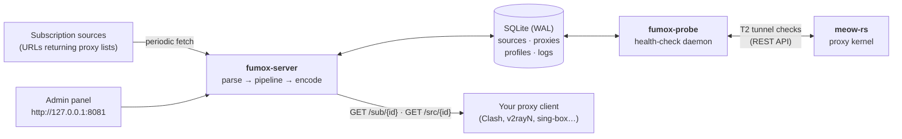
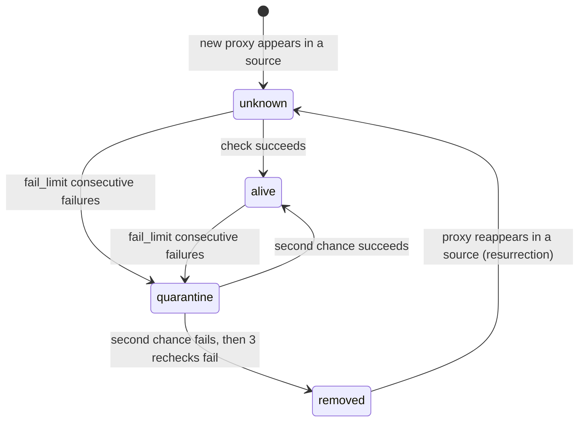

# Fumox User Guide

*Русская версия: [USERGUIDE.ru.md](./USERGUIDE.ru.md)*

This guide is written for people, not for machines: it explains what Fumox is,
how it works, how to install and configure it, and how to use it day to day.
If you only have five minutes, read sections [1](#1-what-is-fumox),
[2](#2-how-it-works) and the [Quick start](#4-quick-start).

---

## Table of contents

- [Fumox User Guide](#fumox-user-guide)
  - [Table of contents](#table-of-contents)
  - [1. What is Fumox](#1-what-is-fumox)
  - [2. How it works](#2-how-it-works)
  - [3. Key concepts](#3-key-concepts)
  - [4. Quick start](#4-quick-start)
    - [Option A — Docker Compose (recommended)](#option-a--docker-compose-recommended)
    - [Option B — Pre-built container image](#option-b--pre-built-container-image)
    - [Option C — Build from source](#option-c--build-from-source)
  - [5. Your first subscription — step by step](#5-your-first-subscription--step-by-step)
  - [6. Subscription endpoints](#6-subscription-endpoints)
    - [Access tokens](#access-tokens)
    - [Output formats](#output-formats)
    - [Response behavior (what your client sees)](#response-behavior-what-your-client-sees)
  - [7. The admin panel](#7-the-admin-panel)
    - [Signing in](#signing-in)
    - [What's inside](#whats-inside)
    - [Import and export](#import-and-export)
    - [Languages and themes](#languages-and-themes)
  - [8. Configuration reference](#8-configuration-reference)
    - [How configuration is resolved](#how-configuration-is-resolved)
    - [`[server]` — public listener](#server--public-listener)
    - [`[database]` — SQLite](#database--sqlite)
    - [`[fetch]` — source fetching](#fetch--source-fetching)
    - [`[geo]` — geo enrichment](#geo--geo-enrichment)
    - [`[admin]` — admin panel](#admin--admin-panel)
    - [`[probe]` — health-check daemon](#probe--health-check-daemon)
    - [`[meow]` — meow-rs integration (T2)](#meow--meow-rs-integration-t2)
    - [`[retention]` — history rotation](#retention--history-rotation)
  - [9. The processing pipeline](#9-the-processing-pipeline)
  - [10. Health checks and proxy lifecycle](#10-health-checks-and-proxy-lifecycle)
    - [The status state machine](#the-status-state-machine)
  - [11. Geo enrichment](#11-geo-enrichment)
  - [12. Data, backups, retention](#12-data-backups-retention)
  - [13. Running in production — checklist](#13-running-in-production--checklist)
  - [14. Troubleshooting](#14-troubleshooting)
  - [15. Where to read more](#15-where-to-read-more)

---

## 1. What is Fumox

**Fumox** is a lightweight proxy-subscription aggregation service written in
Rust. You point it at any number of *subscription sources* — URLs that return
lists of proxy links — and Fumox turns that chaos into clean, filtered
subscriptions you can paste straight into your proxy client (v2rayN, Nekobox,
Clash/Mihomo, sing-box and similar).

Concretely, Fumox:

- **Fetches** your sources on a schedule (or on demand), transparently decoding
  base64 payloads and auto-detecting the input format (URI lists, Clash YAML,
  sing-box JSON).
- **Parses** every proxy line into a normalized model. Supported protocols:
  `vless`, `vmess`, `trojan`, `ss` (Shadowsocks), `hysteria2`, `tuic`, `mieru`,
  `socks5`, `naive+https`. Parameters Fumox doesn't recognize are carried
  through untouched — nothing is ever lost.
- **Processes** proxies through a configurable pipeline: protocol filters,
  regex renaming, geo-tagging with country flags, health filtering,
  deduplication, sorting.
- **Health-checks** proxies in the background: dead nodes are quarantined and
  disappear from your subscriptions automatically; recovered nodes come back.
- **Serves** the result over HTTP in the format your client understands:
  plain URI list, base64, Clash/Mihomo YAML or sing-box JSON.

What this means in practice:

| Without Fumox                                                    | With Fumox                                 |
| ---------------------------------------------------------------- | ------------------------------------------ |
| A dozen subscription URLs, each dying or changing without notice | One stable URL per use case                |
| Dead proxies sit in your client until you notice                 | Dead proxies are quarantined automatically |
| The same node appears three times under different names          | Duplicates are merged across all sources   |
| Names like `relay-01-xyz`                                        | Names like `🇩🇪 Germany · relay-01-xyz`      |
| One format per source                                            | One format per profile — you choose        |

## 2. How it works

Fumox is a Cargo workspace with three crates and one external helper:

| Component      | Type             | What it does                                                                                                                                                           |
| -------------- | ---------------- | ---------------------------------------------------------------------------------------------------------------------------------------------------------------------- |
| `fumox-core`   | library          | Shared data models, SQLite storage and migrations, protocol parsers/serializers, geo resolution, fingerprinting, configuration loading                                 |
| `fumox-server` | binary           | Fetches sources, runs the processing pipeline, serves subscriptions (`/sub`, `/src`) and the admin panel                                                               |
| `fumox-probe`  | binary           | Health-check daemon: probes proxies and manages their lifecycle (alive / quarantine / removed)                                                                         |
| **meow-rs**    | external process | A mihomo/Clash-compatible proxy kernel with a REST API. The probe drives it for real tunnel checks (T2). Fumox never installs or manages it — it only talks to its API |

Everything shares one SQLite database in WAL mode — it is the single source of
truth. In-memory caches exist only to answer requests faster.



**A request's journey.** When your proxy client polls
`GET /sub/{token}`, the server assembles the profile's sources, applies the
pipeline (filters → rename → geo → health filter → dedup → sort), encodes the
result in the profile's output format and answers. The rendered result is
cached, so most requests are served from memory; the cache refreshes in the
background (stale-while-revalidate).

**The background loop.** Independently of requests, `fumox-server` runs a
scheduler that periodically re-fetches every enabled source, reconciles the
parsed proxies with the database (new → insert, gone → mark removed, reappeared
→ resurrect), and journals every fetch. Meanwhile `fumox-probe` samples proxies
and updates their health status, which the health filter then uses.

Two network listeners are involved, on purpose separated:

| Listener | Default address  | Serves                                           | Exposed to the network?                                            |
| -------- | ---------------- | ------------------------------------------------ | ------------------------------------------------------------------ |
| Public   | `0.0.0.0:8080`   | `GET /sub/{id}`, `GET /src/{id}`, `GET /healthz` | Yes — this is what your clients poll                               |
| Admin    | `127.0.0.1:8081` | The admin panel (`/admin/*`)                     | No — loopback only; reach it via SSH tunnel or a TLS reverse proxy |

## 3. Key concepts

| Concept                        | Meaning                                                                                                                                                                     |
| ------------------------------ | --------------------------------------------------------------------------------------------------------------------------------------------------------------------------- |
| **Source**                     | A subscription URL plus its fetch settings (TTL, encoding, headers, pipeline).                                                                                              |
| **Proxy**                      | One normalized proxy record. Its identity is a *fingerprint*, not its name.                                                                                                 |
| **Fingerprint**                | `sha256(scheme \| normalized host \| port \| credential \| security parameters)`. The display name is deliberately excluded, so renaming a proxy never creates a duplicate. |
| **Profile**                    | A named set of sources + processing rules + output format. Each profile has its own endpoint `/sub/{id or slug}` — this is the URL you put in your client.                  |
| **Slug**                       | An optional human-readable identifier for a source or profile (`/sub/my-list` instead of `/sub/nNqRYHbOSqM5`).                                                              |
| **Pipeline**                   | JSON rules describing how proxies are filtered, renamed, geo-tagged, deduplicated and sorted. A source has its own pipeline; a profile can override it.                     |
| **Status**                     | A proxy's health state: `unknown`, `alive`, `quarantine`, `removed` (see [section 10](#10-health-checks-and-proxy-lifecycle)).                                              |
| **Quarantine & second chance** | A proxy that keeps failing is excluded from output, then re-checked 24–48 hours later before any final decision.                                                            |
| **T1 / T2**                    | The two health-check levels: T1 = direct TCP/TLS reachability; T2 = a real tunnel request through meow-rs.                                                                  |

IDs and endpoint tokens are `nanoid(12)` strings over the alphabet
`A-Za-z0-9_-` (≈71 bits of entropy — brute-forcing them is pointless).

## 4. Quick start

Three ways to run Fumox. **Docker Compose is the recommended path**: one
command gives you the server, the probe daemon and the meow-rs kernel wired
together.

### Option A — Docker Compose (recommended)

Requirements: Docker with the Compose plugin.

```bash
git clone https://github.com/Viktor45/fumox.git
cd fumox

cp .env.example .env
# edit .env: set a real FUMOX_ADMIN__TOKEN (the admin panel login secret)

docker compose up -d --build
```

That's it. What you get:

- Subscriptions: `http://<host>:8080/sub/{id}`
- Admin panel: <http://127.0.0.1:8081/admin> — log in with the token from `.env`
- Three containers: `server` (fumox-server), `probe` (fumox-probe), `meow`
  (meow-rs kernel for T2 tunnel checks)

Useful `.env` variables (all except the token are optional):

| Variable                          | Default                               | Purpose                                                                                                                                                          |
| --------------------------------- | ------------------------------------- | ---------------------------------------------------------------------------------------------------------------------------------------------------------------- |
| `FUMOX_ADMIN__TOKEN`              | — (**required**)                      | Admin panel login token. The panel is disabled without it.                                                                                                       |
| `FUMOX_MEOW__TEST_URL`            | `http://www.gstatic.com/generate_204` | URL used for T2 delay tests. Override if it is blocked in your region (e.g. `http://cp.cloudflare.com`).                                                         |
| `FUMOX_ADMIN__ALLOW_PRIVATE_URLS` | `false`                               | Allow source URLs pointing at private/loopback addresses (disables the SSRF guard). Local testing only.                                                          |
| `MEOW_VERSION`                    | `latest`                              | The meow-rs release the wrapper image builds from. `latest` resolves the newest release at build time via the GitHub API; set a tag (e.g. `v0.21.2`) to pin one. |

Notes:

- The admin port is published to `127.0.0.1` only. To reach it from another
  machine, use an SSH tunnel (`ssh -L 8081:127.0.0.1:8081 host`) or put a TLS
  reverse proxy in front.
- The SQLite database lives in the `fumox-data` volume; `./config` is mounted
  read-only for `app.toml` and GeoLite2 files.
- meow-rs publishes no official Docker image, so the stack builds a small
  wrapper (`docker/meow/Dockerfile`) around the release binary. Its REST API
  (port 9090) is only reachable from the probe over the internal network.

### Option B — Pre-built container image

CI publishes a multi-arch image (`linux/amd64` + `linux/arm64`, with build
provenance attestation) to GHCR on every push to `main` and on `v*` tags:
`ghcr.io/<owner>/fumox`. The image ships **both** binaries; the server is the
default command, the probe is a command override.

```bash
# Server
docker run -d --name fumox \
  -e FUMOX_ADMIN__TOKEN=<secret> \
  -v fumox-config:/app/config -v fumox-data:/app/data \
  -p 8080:8080 -p 127.0.0.1:8081:8081 \
  ghcr.io/<owner>/fumox

# Probe (same image, shares the same volumes)
docker run -d --name fumox-probe \
  --entrypoint fumox-probe \
  -v fumox-config:/app/config -v fumox-data:/app/data \
  ghcr.io/<owner>/fumox
```

Inside the image: config is read from `/app/config/app.toml` (if mounted), the
database is `/app/data/fumox.db`, and the admin listener is pre-set to
`0.0.0.0:8081` (the compose file publishes it loopback-only). The image
contains no shell or HTTP client — point orchestrator health probes at
`GET /healthz` on port 8080.

### Option C — Build from source

Requirements:

- Rust toolchain **≥ 1.85** (edition 2024).
- System SQLite development package — sqlx links the system library, it is not
  bundled. On Debian/Ubuntu: `sudo apt install libsqlite3-dev pkg-config`.
- No OpenSSL needed (rustls), no frontend build step.

```bash
cargo build --release
# binaries: target/release/fumox-server and target/release/fumox-probe

./target/release/fumox-server            # subscriptions + admin panel
./target/release/fumox-probe             # health-check daemon (separate process)
```

Both binaries accept the same command-line options:

```
fumox-server [OPTIONS]
fumox-probe  [OPTIONS]

Options:
  -c, --config <CONFIG>  Path to the TOML config file
                         (defaults to config/app.toml if present)
  -h, --help             Print help
  -V, --version          Print version
```

That's the entire CLI — everything else is configuration. The server creates
the database and runs migrations on startup, then serves until SIGINT/SIGTERM
(graceful shutdown). The probe opens no listening sockets at all.

For a quick dev run without installing anything:

```bash
cargo run -p fumox-server
cargo run -p fumox-probe
```

## 5. Your first subscription — step by step

A five-minute walkthrough, assuming the stack is running
([Quick start](#4-quick-start)).

1. **Log in.** Open <http://127.0.0.1:8081/admin> and enter your
   `[admin].token` (the `FUMOX_ADMIN__TOKEN` value). Pick your language on the
   login screen if you like — the choice is remembered.

2. **Add a source.** *Sources → New*. Paste the subscription URL, give it a
   name. Everything else has sensible defaults: encoding `auto` (base64 is
   detected automatically), input format auto-detect (URI list / Clash YAML),
   cache TTL 1 hour. Save. The source is fetched immediately — you should see
   how many proxies were found.

3. **Create a profile.** *Profiles → New*. Name it, tick the sources it should
   contain, pick the output format:
   - `uri_list` — plain text, one proxy link per line (universal);
   - `base64` — the same list base64-encoded (what many clients expect);
   - `clash` — Clash/Mihomo YAML config;
   - `sing_box` — sing-box JSON config.

   Optionally set a **slug** (then the endpoint is `/sub/your-slug`) and an
   **access token** (then clients must present it — see below).

4. **Copy the URL.** The profile card shows the subscription URL, e.g.
   `http://<host>:8080/sub/nNqRYHbOSqM5` (or with `?token=…` if you set an
   access token). Paste it into your proxy client as a subscription.

5. **Watch it live.** The dashboard shows source/proxy counts and errors; the
   *Proxies* browser lists every node with its status, country and latency;
   the *Probe* page shows the health-check daemon's heartbeat and the
   quarantine queue. Updates arrive live over server-sent events.

From here on, Fumox keeps fetching your sources (hourly by default), and the
probe keeps checking proxies. Dead nodes drop out of the subscription
automatically; nothing else needs your attention.

## 6. Subscription endpoints

All public endpoints live on the public listener (default port **8080**).

| Endpoint        | Description                                                                  |
| --------------- | ---------------------------------------------------------------------------- |
| `GET /sub/{id}` | Merged subscription for a **profile**. `{id}` is the profile id or its slug. |
| `GET /src/{id}` | Parsed proxies of a **single source**, alive-only (never-probed, quarantined and removed proxies are excluded). `{id}` is the source id or slug. |
| `GET /healthz`  | Liveness probe, returns `ok`.                                                |

### Access tokens

By default a profile's endpoint is public to anyone who knows the URL — the
12-character random id is unguessable. For extra protection a profile can have
an **access token**: then every request must present it, either as

```
GET /sub/{id}?token=<access_token>
```

or as a header:

```
Authorization: Bearer <access_token>
```

Missing or wrong token → `403 Forbidden`.

### Output formats

The format is a property of the profile — one profile, one format. The
`?format=` query parameter is **not supported** and returns `400`; if you need
the same set of proxies in another format, create a second profile (it's
cheap).

| Format     | Content-Type       | Notes                                    |
| ---------- | ------------------ | ---------------------------------------- |
| `uri_list` | `text/plain`       | One proxy URI per line                   |
| `base64`   | `text/plain`       | The URI list, base64-encoded             |
| `clash`    | `text/yaml`        | Clash/Mihomo config, root key `proxies:` |
| `sing_box` | `application/json` | sing-box config, root key `outbounds:`   |

Clash and sing-box output can only represent vless, vmess, trojan, ss,
hysteria2 and socks5; proxies of other protocols (tuic, mieru, naive) are
skipped with a log entry, not an error. Duplicate display names get automatic
suffixes: `Name`, `Name (2)`, `Name (3)`…

### Response behavior (what your client sees)

| Situation                                                                                            | Response                                                                                                                                                                                                                      |
| ---------------------------------------------------------------------------------------------------- | ----------------------------------------------------------------------------------------------------------------------------------------------------------------------------------------------------------------------------- |
| Everything is fine                                                                                   | `200` + fresh data                                                                                                                                                                                                            |
| Some sources are temporarily down (`network`, `http_server` errors)                                  | `200` + last good data for the failed sources, fresh data for the rest; header `X-Fumox-Stale: true`. Stale data is served as long as needed — the health filter keeps cleaning dead proxies out, so the output "self-heals". |
| A source returned HTTP 200 but the content doesn't parse (`parse_error` — anti-bot pages, CDN stubs) | `200` + last good snapshot if one exists, otherwise an empty valid config; header `X-Fumox-Warning: parse-error`                                                                                                              |
| All proxies of the profile are quarantined/removed                                                   | `200` + a valid **empty** config + header `X-Fumox-Warning: all-proxies-quarantined`                                                                                                                                          |
| A source is permanently broken (`http_client`: 400/403/404/410)                                      | The upstream status code is passed through; not cached                                                                                                                                                                        |
| Profile doesn't exist / disabled                                                                     | `404`                                                                                                                                                                                                                         |
| Fumox itself is broken (DB down, bad config)                                                         | `500`                                                                                                                                                                                                                         |

Proxies in `quarantine` or `removed` state never appear in output. Proxies
with status `unknown` (not checked yet, or unprobeable tuic/mieru) **are**
included — better to hand a client a maybe-working node than to throw away
known-good ones.

## 7. The admin panel

The admin panel is a server-rendered web UI (askama + HTMX — every page works
even with JavaScript disabled). It listens on its **own** socket, by default
`127.0.0.1:8081`, physically separated from the public endpoints.

### Signing in

Enter the `[admin].token` value on the login screen. A successful login sets a
signed (HMAC) HttpOnly session cookie, valid for 7 days by default
(`session_ttl_hours`). Changing the token in the config invalidates all
existing sessions. An **empty token** (or `enabled = false`) disables the
panel entirely — every `/admin/*` route answers 404.

Built-in protections: CSRF tokens on every form, per-IP rate limiting
(`120/min` general, `5/min` on login), security response headers
(`X-Frame-Options: DENY` etc.), proxy credentials masked in all lists
(full value only on the proxy detail page, on explicit request).

### What's inside

| Screen              | What you do there                                                                                                                                                                                     |
| ------------------- | ----------------------------------------------------------------------------------------------------------------------------------------------------------------------------------------------------- |
| **Dashboard**       | Totals: sources (enabled/errored), profiles, proxies by status, 24h fetch success rate, probe heartbeat, recent errors and fetches                                                                    |
| **Sources**         | Create/edit/enable/delete sources; *Refresh now*; per-source fetch log with error classes; the `/src/…` link                                                                                          |
| **Profiles**        | Create/edit profiles: composition and order of sources, output format, pipeline overrides, access token, slug; output preview (first 50 lines)                                                        |
| **Proxies**         | Filterable browser of all proxies (status, protocol, country, source, search by host/name); detail card with parameters, geo, lifecycle timestamps and probe history; *Reset status*; *Purge removed* |
| **Fetch log**       | Journal of every source fetch: time, status, bytes, proxies found, error class                                                                                                                        |
| **Probe**           | Health-check daemon status: heartbeat, meow-rs status, quarantine queue with scheduled second chances                                                                                                 |
| **Import / Export** | Backup and migration of the whole configuration (see below)                                                                                                                                           |

### Import and export

*Export* downloads all sources and profiles (with profile composition, headers
and access tokens) as a versioned JSON file. *Import* recreates them with
**create-new-only** semantics:

- imported objects always get fresh ids — existing rows are never overwritten;
- profile composition is remapped onto the new source ids;
- a slug collision → the object is created without a slug (reported as a warning);
- a reference to a source missing from the file → dropped from the composition (warning);
- validation is all-or-nothing: any invalid object aborts the whole import
  (`422` with a list of problems, nothing written).

### Languages and themes

The interface is multilingual: Russian (default) and English ship with the
binary; the language is chosen on the login screen and remembered in the
`fumox_lang` cookie. To add a language, copy any file from `locales/`,
translate the values, save it as `locales/<code>.toml` (flat
`"domain.key" = "text"` pairs) and restart — no rebuild needed. Files on disk
override the embedded catalogs.

Day/night themes are switched on the login screen or in the top bar
(`fumox_theme` cookie); the choice works without JavaScript.

## 8. Configuration reference

### How configuration is resolved

Three layers, later wins:

1. **Built-in defaults** — every key has one; Fumox runs with no config file at all.
2. **TOML file** — `config/app.toml` by default, or whatever you pass via
   `--config / -c`. The file may be partial: only the sections you care about.
3. **Environment variables** — `FUMOX_SECTION__KEY`, where a double underscore
   separates the section from the key:

   ```bash
   FUMOX_ADMIN__TOKEN=secret          # [admin] token
   FUMOX_DATABASE__PATH=/data/f.db    # [database] path
   FUMOX_MEOW__API_ADDR=meow:9090     # [meow] api_addr
   ```

The annotated reference file shipped with the repo is
[`config/app.toml`](./config/app.toml). Below is the same information in table
form.

### `[server]` — public listener

| Key    | Default          | Meaning                                                     |
| ------ | ---------------- | ----------------------------------------------------------- |
| `bind` | `"0.0.0.0:8080"` | Address of the public listener (`/sub`, `/src`, `/healthz`) |

### `[database]` — SQLite

| Key               | Default      | Meaning                                                                                 |
| ----------------- | ------------ | --------------------------------------------------------------------------------------- |
| `path`            | `"fumox.db"` | Database file path                                                                      |
| `busy_timeout_ms` | `5000`       | Wait for locks instead of failing. Keep it set: server and probe write to the same file |
| `max_connections` | `8`          | Pool size                                                                               |

### `[fetch]` — source fetching

| Key                     | Default             | Meaning                                                         |
| ----------------------- | ------------------- | --------------------------------------------------------------- |
| `connect_timeout_secs`  | `10`                | TCP connect timeout                                             |
| `read_timeout_secs`     | `30`                | Response read timeout                                           |
| `max_response_bytes`    | `10485760` (10 MiB) | Response size cap (decompression-bomb guard)                    |
| `max_concurrency`       | `4`                 | How many sources are fetched in parallel                        |
| `max_retries`           | `2`                 | Retries, only for recoverable errors (`network`, `http_server`) |
| `retry_base_backoff_ms` | `500`               | Exponential backoff base between retries                        |
| `user_agent`            | `"fumox/<version>"` | User-Agent header; per-source `headers` override it             |

### `[geo]` — geo enrichment

| Key                 | Default     | Meaning                                                    |
| ------------------- | ----------- | ---------------------------------------------------------- |
| `enabled`           | `true`      | Master switch                                              |
| `db`                | `"country"` | Which GeoLite2 database to use: `country`, `city` or `asn` |
| `db_dir`            | `"config"`  | Directory containing `GeoLite2-{Country,City,ASN}.mmdb`    |
| `cache_max_entries` | `16384`     | Host→geo cache size                                        |
| `dns_timeout_secs`  | `5`         | DNS resolution timeout                                     |

### `[admin]` — admin panel

| Key                  | Default            | Meaning                                                                                                                                                 |
| -------------------- | ------------------ | ------------------------------------------------------------------------------------------------------------------------------------------------------- |
| `enabled`            | `true`             | Master switch                                                                                                                                           |
| `token`              | `"change-me"`      | Login secret. **Change it.** Empty value disables the panel (404)                                                                                       |
| `bind`               | `"127.0.0.1:8081"` | Admin listener address. Keep it on loopback; expose only via reverse proxy/SSH tunnel                                                                   |
| `session_ttl_hours`  | `168`              | Session cookie lifetime (7 days)                                                                                                                        |
| `allow_private_urls` | `false`            | SSRF guard: when false, source URLs may not resolve to loopback, RFC1918, link-local or cloud-metadata addresses (checked at save *and* at every fetch) |
| `rate_limit`         | `"120/min"`        | Per-IP limit for admin routes                                                                                                                           |
| `login_rate_limit`   | `"5/min"`          | Per-IP limit for the login form                                                                                                                         |
| `locales_dir`        | `"locales"`        | Directory with UI translation catalogs (`<code>.toml`)                                                                                                  |

### `[probe]` — health-check daemon

| Key                          | Default | Meaning                                                                       |
| ---------------------------- | ------- | ----------------------------------------------------------------------------- |
| `cycle_interval_secs`        | `60`    | Scheduling cycle period                                                       |
| `sample_size`                | `50`    | Random sample of proxies checked per cycle (spreads load, no bursts)          |
| `refresh_check_limit`        | `50`    | Newly inserted unknown proxies per source refresh queued for priority checking (`0` disables the queue) |
| `fail_limit`                 | `3`     | Consecutive failures before quarantine                                        |
| `connect_timeout_secs`       | `10`    | T1 TCP-connect timeout                                                        |
| `tls_timeout_secs`           | `10`    | T1 TLS-handshake timeout                                                      |
| `concurrency`                | `8`     | Parallel checks                                                               |
| `heartbeat_interval_secs`    | `30`    | How often the daemon writes its heartbeat (shown in the admin panel)          |
| `second_chance_min_hours`    | `24`    | Second-chance window start, hours after quarantine                            |
| `second_chance_spread_hours` | `24`    | Window width: the check happens at `+24h + U(0..24h)`, i.e. within [24h, 48h) |
| `retention_interval_secs`    | `86400` | How often old history is purged                                               |

### `[meow]` — meow-rs integration (T2)

| Key            | Default                                 | Meaning                                                                                                                      |
| -------------- | --------------------------------------- | ---------------------------------------------------------------------------------------------------------------------------- |
| `api_addr`     | `"127.0.0.1:9090"`                      | meow-rs REST API address (its external-controller)                                                                           |
| `config_path`  | `"config/meow.yaml"`                    | Where the probe writes the generated Clash config. **Must be a path meow-rs itself can read** (in Docker: the shared volume) |
| `test_url`     | `"http://www.gstatic.com/generate_204"` | URL fetched through the proxy for delay tests. May be blocked in some regions — change it if T2 fails everywhere             |
| `timeout_secs` | `10`                                    | Per-check timeout                                                                                                            |

### `[retention]` — history rotation

| Key                  | Default | Meaning                           |
| -------------------- | ------- | --------------------------------- |
| `probe_results_days` | `14`    | Keep probe history for N days     |
| `fetch_log_days`     | `30`    | Keep the fetch journal for N days |

## 9. The processing pipeline

The pipeline is a versioned JSON document stored on a source and/or a profile
(the profile's pipeline overrides matching sections of the source's). All
sections are optional — `{}` (or no pipeline at all) means "pass through and
deduplicate by fingerprint". `"version": 1` is required.

```json
{
  "version": 1,
  "filter": {
    "protocols": ["vless", "trojan"],
    "exclude_protocols": ["naive"],
    "normalize_params": true
  },
  "rename": [
    { "match": "^(.*?)\\s*\\|", "replace": "$1", "flags": "i" }
  ],
  "geo": { "enabled": true, "template": "{flag} {country} · {name}" },
  "health": { "exclude_statuses": ["quarantine", "removed"] },
  "dedup": { "by": "fingerprint" },
  "sort": { "by": "source", "desc": false }
}
```

| Section  | What it does                                                 | Fields and defaults                                                                                                              |
| -------- | ------------------------------------------------------------ | -------------------------------------------------------------------------------------------------------------------------------- |
| `filter` | Keep/drop protocols; normalize `insecure=1`-style parameters | `protocols` / `exclude_protocols`: lists or null (= all); `normalize_params`: default `true`                                     |
| `rename` | Regex-based renaming, rules applied in order                 | `match` (regex), `replace`, `flags` (e.g. `"i"`); default `[]`                                                                   |
| `geo`    | Rewrite display names with geo data                          | `enabled` (default `true`), `template` (default `"{flag} {country} · {name}"`; placeholders in [section 11](#11-geo-enrichment)) |
| `health` | Drop proxies by status                                       | `exclude_statuses`, default `["quarantine", "removed"]`                                                                          |
| `dedup`  | Deduplication                                                | `by`: only `"fingerprint"` in v1                                                                                                 |
| `sort`   | Output ordering                                              | `by`: `source` \| `name` \| `country` \| `latency` (null latencies go last); `desc`: default `false`                             |

Validation is strict: unknown keys, a non-compiling regex or an invalid enum
value are rejected with a field error in the admin form — nothing is saved.
This strictness is deliberate, so a future schema v2 can add fields without
ambiguity.

The pipeline runs in a fixed order:
**parse → filter → rename → geo → health-filter → merge + dedup → sort → encode.**

## 10. Health checks and proxy lifecycle

The `fumox-probe` daemon runs an endless cycle (default: every 60 s), each
cycle in four passes:

1. **Quarantine dues** — second chances and recheck-ladder steps whose moment
   has arrived;
2. **Priority queue** — freshly inserted proxies the server queued at source
   refresh time (up to `[probe].refresh_check_limit` per refresh), drained
   newest first, then removed from the queue before the checks run;
3. **T1** — a random sample of direct TCP-connect (plus TLS handshake where
   the protocol implies TLS) checks over `unknown`/`alive` proxies;
4. **T2** — real tunnel checks for `alive` proxies through meow-rs: the probe
   writes a Clash config with the batch, hot-reloads meow-rs via
   `PUT /configs`, then measures delay via `GET /proxies/{name}/delay` against
   `[meow].test_url`.

The priority queue gives brand-new proxies a first check within one cycle of
the source refresh instead of waiting out the random sample — with large
pools that wait can otherwise stretch to hours or days. Unprobeable schemes
are never queued (they could not be checked anyway), and a proxy that leaves
`unknown` through the random path simply drops out of the queue.

| Level            | What it proves                                               | Applies to                                  |
| ---------------- | ------------------------------------------------------------ | ------------------------------------------- |
| **T1** (TCP/TLS) | The server is reachable at `host:port`                       | vless, vmess, trojan, ss, socks5, naive     |
| **T2** (tunnel)  | The proxy *actually works*: credentials valid, traffic flows | vless, vmess, trojan, ss, hysteria2, socks5 |

QUIC protocols (hysteria2, tuic) skip T1 — a TCP connect to a UDP port proves
nothing. **tuic and mieru are unprobeable** altogether (meow-rs doesn't
support them): they keep status `unknown` forever, always pass health filters,
and are badged "unprobeable" in the admin panel. Exclude them with
`filter.protocols` if you don't want them in a profile.

### The status state machine



The rules in plain language:

- **Success always wins.** Any successful check makes the proxy `alive` and
  clears all failure counters and schedules.
- **Quarantine.** `fail_limit` (default 3) consecutive failures move an
  `unknown`/`alive` proxy to `quarantine`. It disappears from subscriptions
  immediately.
- **Second chance.** At a random moment 24–48 hours after quarantine
  (`quarantined_at + 24h + U(0..24h)`, UTC, drawn once and stored) the proxy
  is re-checked. Success → back to `alive`.
- **Recheck ladder.** A failed second chance is followed by rechecks at
  +15 min, +30 min and +1 hour. Any success → `alive`. All three fail →
  `removed`.
- **Removed is not deleted.** Removed proxies stay in the database (purge them
  from the admin panel if you want). If a removed proxy shows up in a source
  again, it is resurrected with status `unknown` and a clean slate.

If meow-rs is down, T2 doesn't spam it: the probe backs off exponentially
(60 s → doubling → capped at 15 min), and proxy statuses are left untouched —
a dead meow-rs is never mistaken for dead proxies. T1 and the server are
unaffected; Fumox works fine without meow-rs, just without tunnel-level
verification.

All lifecycle state lives in SQLite, so the daemon is restart-safe: restart it
anytime, schedules resume from the database.

## 11. Geo enrichment

Fumox can prepend geographic information to proxy display names using free
MaxMind GeoLite2 databases.

**Setup:**

Manual installation (e.g. with your own MaxMind license) works the same:

1. Register a free account at <https://www.maxmind.com/en/geolite2/signup>.
2. Download the database you need via
   [Account → Manage License Keys / Download Databases](https://dev.maxmind.com/geoip/docs/databases/).
3. Place the file into `[geo].db_dir` (default `config/`) under its canonical
   name: `GeoLite2-Country.mmdb`, `GeoLite2-City.mmdb` or `GeoLite2-ASN.mmdb`.

Pick the database with `[geo].db` (`country` by default). If the file is
missing, geo enrichment quietly disables itself (a warning is logged) and
everything else keeps working. MaxMind updates their databases weekly.

Fumox fetches the databases itself: at startup the server checks
`[geo].db_dir` and downloads any GeoLite2 database that is missing, broken
or older than a month from a public release mirror.

**Name templates.** The `geo.template` pipeline setting (default
`"{flag} {country} · {name}"`) supports these placeholders:

| Placeholder | Meaning                               | Requires                 |
| ----------- | ------------------------------------- | ------------------------ |
| `{flag}`    | Country flag emoji                    | Country or City database |
| `{country}` | Country name (falls back to ISO code) | Country or City database |
| `{city}`    | City name                             | City database            |
| `{asn}`     | AS number, rendered as `AS12345`      | ASN database             |
| `{asn_org}` | AS organization name                  | ASN database             |
| `{name}`    | The original display name             | —                        |

A placeholder with no data behind it collapses to nothing — extra whitespace
and dangling separators are cleaned up, so `"{flag} {country} {city} · {name}"`
still looks right when the city is unknown. The name is left completely
untouched only when there is no geo data at all. DNS and geo lookups are
cached (hosts repeat a lot).

**Stored geo facts.** The country, city and ASN resolved for each proxy are
persisted to the database at ingest time (and a background pass at startup
fills in proxies that were ingested before a database was available). This is
what feeds the admin panel: the country filter in the *Proxies* list and the
*Geography* block of the proxy card show stored facts, so they populate after
the next source refresh or server restart — even if no subscription has been
requested yet. A fresh lookup that returns nothing never erases facts already
stored.

## 12. Data, backups, retention

- **Storage.** One SQLite file in WAL mode. It contains proxy credentials in
  plaintext — the file is created with `0600` permissions; keep the directory
  access restricted.
- **Backups.** Use the WAL-safe online backup, not a raw file copy:

  ```bash
  sqlite3 fumox.db ".backup /backups/fumox-$(date +%F).db"
  ```

- **Growth control.** The probe purges history automatically:
  `probe_results` older than 14 days and `fetch_log` older than 30 days by
  default (`[retention]`). Removed proxies accumulate until you press *Purge
  removed* in the admin panel.
- **Configuration backup.** Use the admin panel's *Export* — it captures all
  sources and profiles in a JSON file you can import on another instance.
- **Timestamps** everywhere are Unix epoch seconds, UTC.

## 13. Running in production — checklist

- [ ] Strong `[admin].token` set (the shipped `change-me` is a placeholder).
- [ ] Admin listener stays on loopback; external access only through a TLS
      reverse proxy or SSH tunnel.
- [ ] `allow_private_urls` left `false` (SSRF protection), unless you have a
      specific trusted-internal-source reason.
- [ ] One `fumox-server` + one `fumox-probe` against the same database file;
      `busy_timeout_ms` stays set.
- [ ] meow-rs runs as its own long-lived service (systemd unit / container
      with restart policy) with its REST API at `[meow].api_addr`;
      `[meow].config_path` is readable by the meow-rs process.
- [ ] `[meow].test_url` is reachable from your proxies' networks.
- [ ] GeoLite2 database downloaded into `[geo].db_dir` (if you want geo names).
- [ ] Regular DB backups via `sqlite3 ".backup"`.
- [ ] Process supervision with automatic restart (`systemd`, Docker
      `restart: unless-stopped`, etc.). Both binaries shut down gracefully on
      SIGTERM.

A minimal systemd sketch:

```ini
# /etc/systemd/system/fumox-server.service
[Unit]
Description=Fumox subscription server
After=network-online.target

[Service]
ExecStart=/opt/fumox/fumox-server --config /etc/fumox/app.toml
Restart=always
User=fumox

[Install]
WantedBy=multi-user.target
```

(The probe gets an identical unit with `fumox-probe`; meow-rs gets its own.)

## 14. Troubleshooting

| Symptom                                                               | Likely cause / fix                                                                                                                                 |
| --------------------------------------------------------------------- | -------------------------------------------------------------------------------------------------------------------------------------------------- |
| Admin panel returns 404 everywhere                                    | `[admin].token` is empty or `enabled = false` — the panel is intentionally inert. Set a token and restart.                                         |
| Can't reach the admin panel from another machine                      | It binds to `127.0.0.1` by design. Use `ssh -L 8081:127.0.0.1:8081 host` or a reverse proxy.                                                       |
| `/sub/…` returns 403                                                  | The profile has an access token — add `?token=…` or the `Authorization: Bearer` header.                                                            |
| `/sub/…?format=clash` returns 400                                     | `?format=` is forbidden by design. Create a separate profile with the needed format.                                                               |
| Subscription is empty with `X-Fumox-Warning: all-proxies-quarantined` | Every proxy failed its checks. Look at the *Probe* page and the proxies' history; check `[meow].test_url` reachability.                            |
| `X-Fumox-Stale: true` header                                          | Some sources are temporarily unreachable; last good data is being served. The fetch log shows which sources and why (`error_class`).               |
| Source shows `parse_error`                                            | The source returned HTTP 200 but unparseable content (anti-bot page, CDN stub, format change). The last good snapshot is served meanwhile.         |
| Source won't save: "private URL" error                                | The URL resolves to a loopback/private address and `allow_private_urls` is false. That's the SSRF guard working.                                   |
| No country flags in names                                             | GeoLite2 `.mmdb` file missing from `[geo].db_dir` or `[geo].enabled = false`.                                                                      |
| T2 checks never run, probe logs mention meow backoff                  | meow-rs is down or `[meow].api_addr` is wrong. In Docker, it must be `meow:9090`; the config path must be the shared volume (`/shared/meow.yaml`). |
| `SQLITE_BUSY` errors in logs                                          | `busy_timeout_ms` was removed or set too low while two processes write to the DB. Restore the default (5000).                                      |
| Build fails: `sqlite3.h: No such file`                                | Install the system SQLite dev package (`libsqlite3-dev` on Debian/Ubuntu).                                                                         |
| Compose refuses to start: "set FUMOX_ADMIN__TOKEN"                    | Create `.env` from `.env.example` and set the token.                                                                                               |

## 15. Where to read more

| Document                                                      | Contents                                          |
| ------------------------------------------------------------- | ------------------------------------------------- |
| [`README.md`](./README.md) / [`README.ru.md`](./README.ru.md) | Project overview, name story, minimal quick start |
| [`config/app.toml`](./config/app.toml)                        | Annotated reference configuration                 |
