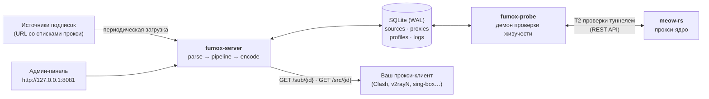
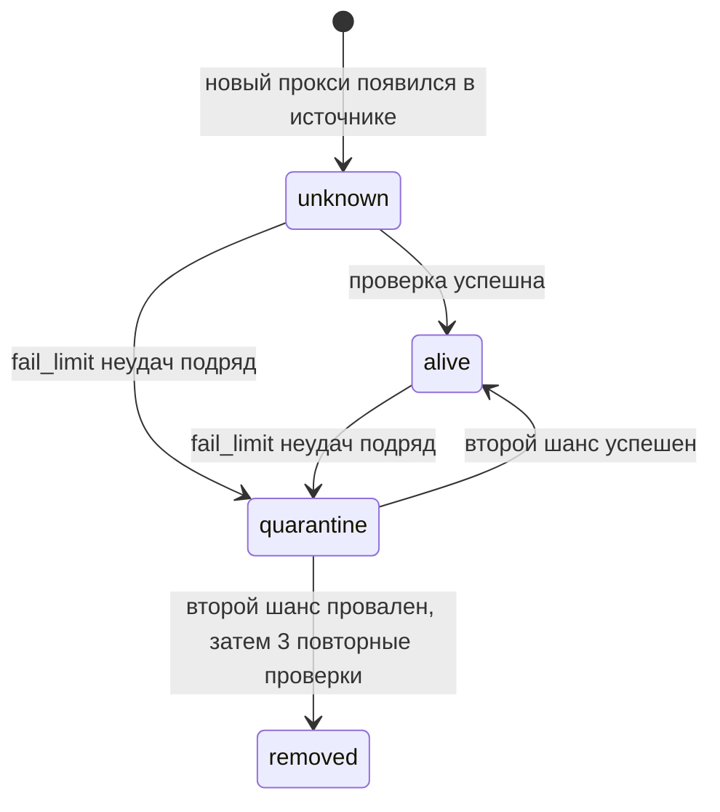

# Руководство пользователя Fumox

*English version: [USERGUIDE.md](./USERGUIDE.md)*

Это руководство написано для людей, а не для машин: оно объясняет, что такое
Fumox, как он устроен, как его установить и настроить и как пользоваться им
каждый день. Если у вас есть только пять минут — прочитайте разделы
[1](#1-что-такое-fumox), [2](#2-как-это-работает) и
[быстрый старт](#4-быстрый-старт).

---

## Содержание

- [Руководство пользователя Fumox](#руководство-пользователя-fumox)
  - [Содержание](#содержание)
  - [1. Что такое Fumox](#1-что-такое-fumox)
  - [2. Как это работает](#2-как-это-работает)
  - [3. Ключевые понятия](#3-ключевые-понятия)
  - [4. Быстрый старт](#4-быстрый-старт)
    - [Вариант A — Docker Compose (рекомендуется)](#вариант-a--docker-compose-рекомендуется)
    - [Вариант B — Готовый контейнерный образ](#вариант-b--готовый-контейнерный-образ)
    - [Вариант C — Сборка из исходников](#вариант-c--сборка-из-исходников)
  - [5. Первая подписка — по шагам](#5-первая-подписка--по-шагам)
  - [6. Эндпоинты подписок](#6-эндпоинты-подписок)
    - [Токены доступа](#токены-доступа)
    - [Выходные форматы](#выходные-форматы)
    - [Страновой фильтр](#страновой-фильтр)
    - [Поведение ответов (что видит ваш клиент)](#поведение-ответов-что-видит-ваш-клиент)
  - [7. Админ-панель](#7-админ-панель)
    - [Вход](#вход)
    - [Что внутри](#что-внутри)
    - [Время и часовые пояса](#время-и-часовые-пояса)
    - [Импорт и экспорт](#импорт-и-экспорт)
    - [Языки и темы](#языки-и-темы)
  - [8. Справочник по конфигурации](#8-справочник-по-конфигурации)
    - [Как разрешается конфигурация](#как-разрешается-конфигурация)
    - [`[server]` — публичный слушатель](#server--публичный-слушатель)
    - [`[database]` — SQLite](#database--sqlite)
    - [`[fetch]` — загрузка источников](#fetch--загрузка-источников)
    - [`[ingest]` — инжест источников](#ingest--инжест-источников)
    - [`[geo]` — гео-обогащение](#geo--гео-обогащение)
    - [`[admin]` — админ-панель](#admin--админ-панель)
    - [`[probe]` — демон проверки живучести](#probe--демон-проверки-живучести)
    - [`[meow]` — интеграция с meow-rs (T2)](#meow--интеграция-с-meow-rs-t2)
    - [`[retention]` — ротация истории](#retention--ротация-истории)
    - [`[log]` — уровни консольных логов](#log--уровни-консольных-логов)
  - [9. Конвейер обработки (pipeline)](#9-конвейер-обработки-pipeline)
  - [10. Проверка живучести и жизненный цикл прокси](#10-проверка-живучести-и-жизненный-цикл-прокси)
    - [Машина состояний статусов](#машина-состояний-статусов)
  - [11. Гео-обогащение](#11-гео-обогащение)
  - [12. Данные, резервные копии, ротация](#12-данные-резервные-копии-ротация)
  - [13. Продакшен — контрольный список](#13-продакшен--контрольный-список)
  - [14. Решение проблем](#14-решение-проблем)
  - [15. Где читать дальше](#15-где-читать-дальше)

---

## 1. Что такое Fumox

**Fumox** — лёгкий сервис агрегации прокси-подписок, написанный на Rust. Вы
указываете ему любое количество *источников* — URL, возвращающих списки
прокси-ссылок, — а Fumox превращает этот хаос в чистые, отфильтрованные
подписки, которые можно сразу вставить в прокси-клиент (v2rayN, Nekobox,
Clash/Mihomo, sing-box и подобные).

Конкретно Fumox:

- **Скачивает** источники по расписанию (или по запросу), прозрачно
  декодируя base64 и автоматически определяя формат входа (URI-списки,
  Clash YAML, sing-box JSON).
- **Разбирает** каждую прокси-строку в нормализованную модель. Поддерживаемые
  протоколы: `vless`, `vmess`, `trojan`, `ss` (Shadowsocks), `hysteria2`,
  `tuic`, `mieru`, `socks5`, `naive+https`. Нераспознанные параметры
  переносятся как есть — ничего не теряется.
- **Обрабатывает** прокси через настраиваемый конвейер: фильтры по протоколам,
  переименование по regex, гео-теги с флагами стран, фильтрация по живучести,
  дедупликация, сортировка.
- **Проверяет живучесть** прокси в фоне: мёртвые узлы автоматически уходят в
  карантин и исчезают из подписок; восстановившиеся — возвращаются.
- **Отдаёт** результат по HTTP в формате, который понимает ваш клиент:
  обычный URI-список, base64, Clash/Mihomo YAML или sing-box JSON.

Что это даёт на практике:

| Без Fumox                                                                       | С Fumox                                        |
| ------------------------------------------------------------------------------- | ---------------------------------------------- |
| Десяток URL подписок, каждая из которых умирает или меняется без предупреждения | Один стабильный URL на каждый случай           |
| Мёртвые прокси висят в клиенте, пока вы не заметите                             | Мёртвые прокси автоматически уходят в карантин |
| Один и тот же узел трижды под разными именами                                   | Дубликаты сливаются по всем источникам         |
| Имена вида `relay-01-xyz`                                                       | Имена вида `🇩🇪 Germany · relay-01-xyz`          |
| Один формат на источник                                                         | Один формат на профиль — выбираете вы          |

## 2. Как это работает

Fumox — это Cargo-workspace из трёх крейтов и одного внешнего помощника:

| Компонент      | Тип             | Что делает                                                                                                                                                                                |
| -------------- | --------------- | ----------------------------------------------------------------------------------------------------------------------------------------------------------------------------------------- |
| `fumox-core`   | библиотека      | Общие модели данных, SQLite-хранилище и миграции, парсеры/сериализаторы протоков, гео-резолвер, фингерпринты, загрузка конфигурации                                                       |
| `fumox-server` | бинарник        | Скачивает источники, выполняет конвейер обработки, отдаёт подписки (`/sub`, `/src`) и админ-панель                                                                                        |
| `fumox-probe`  | бинарник        | Демон проверки живучести: проверяет прокси и управляет их жизненным циклом (alive / quarantine / removed)                                                                                 |
| **meow-rs**    | внешний процесс | Прокси-ядро, совместимое с mihomo/Clash, с REST API. Probe использует его для настоящих туннельных проверок (T2). Fumox не устанавливает и не запускает его — только обращается к его API |

Все компоненты используют одну базу SQLite в режиме WAL — это единственный
источник истины. In-memory кэши существуют лишь для ускорения ответов.



**Путь запроса.** Когда прокси-клиент опрашивает `GET /sub/{token}`, сервер
собирает источники профиля, применяет конвейер (фильтры → переименование →
гео → health-фильтр → дедупликация → сортировка), кодирует результат в
выходной формат профиля и отвечает. Готовый результат кэшируется, поэтому
большинство запросов обслуживается из памяти; кэш обновляется в фоне
(stale-while-revalidate).

**Фоновый цикл.** Независимо от запросов `fumox-server` запускает планировщик,
который периодически перезагружает каждый включённый источник, сверяет
разобранные прокси с базой (новые → вставить, исчезнувшие → отвязать; пока
probe подтверждает `alive`-прокси, он остаётся привязанным — см. alive-linger
в [разделе 10](#10-проверка-живучести-и-жизненный-цикл-прокси), вернувшиеся →
обновить только поля-идентичность) и журналирует каждую загрузку. Тем временем
`fumox-probe` выбирает прокси и обновляет их статус живучести, который затем
использует health-фильтр.

Сетевых слушателя два, и они намеренно разделены:

| Слушатель | Адрес по умолчанию | Отдаёт                                           | Виден из сети?                                                        |
| --------- | ------------------ | ------------------------------------------------ | --------------------------------------------------------------------- |
| Публичный | `0.0.0.0:8080`     | `GET /sub/{id}`, `GET /src/{id}`, `GET /healthz` | Да — именно его опрашивают клиенты                                    |
| Админка   | `127.0.0.1:8081`   | Админ-панель (`/admin/*`)                        | Нет — только loopback; доступ через SSH-туннель или TLS reverse-proxy |

## 3. Ключевые понятия

| Понятие                    | Значение                                                                                                                                                                             |
| -------------------------- | ------------------------------------------------------------------------------------------------------------------------------------------------------------------------------------ |
| **Источник (source)**      | URL подписки и настройки его загрузки (TTL, кодировка, заголовки, pipeline).                                                                                                         |
| **Прокси (proxy)**         | Одна нормализованная прокси-запись. Его идентичность — *фингерпринт*, а не имя.                                                                                                      |
| **Фингерпринт**            | `sha256(scheme \| нормализованный host \| port \| credential \| security-параметры)`. Отображаемое имя намеренно не входит, поэтому переименование никогда не создаёт дубликатов.    |
| **Профиль (profile)**      | Именованный набор источников + правила обработки + выходной формат. У каждого профиля свой эндпоинт `/sub/{id или slug}` — именно этот URL вы вставляете в клиент.                   |
| **Slug**                   | Необязательный человекочитаемый идентификатор источника или профиля (`/sub/my-list` вместо `/sub/nNqRYHbOSqM5`).                                                                     |
| **Pipeline**               | JSON-правила, описывающие, как прокси фильтруются, переименовываются, получают гео-теги, дедуплицируются и сортируются. У источника свой pipeline; профиль может его переопределить. |
| **Статус**                 | Состояние живучести прокси: `unknown`, `alive`, `quarantine`, `removed` (см. [раздел 10](#10-проверка-живучести-и-жизненный-цикл-прокси)).                                           |
| **Карантин и второй шанс** | Прокси, который стабильно не проходит проверки, исключается из выдачи, а через 24–48 часов получает повторную проверку до принятия окончательного решения.                           |
| **T1 / T2**                | Два уровня проверки живучести: T1 = прямая TCP/TLS-доступность; T2 = настоящий запрос через туннель через meow-rs.                                                                   |

Идентификаторы и токены эндпоинтов — строки `nanoid(12)` из алфавита
`A-Za-z0-9_-` (≈71 бит энтропии — перебор бессмысленен).

## 4. Быстрый старт

Три способа запустить Fumox. **Рекомендуемый — Docker Compose**: одна команда
поднимает сервер, probe-демон и ядро meow-rs, уже связанные между собой.
Используете Podman вместо Docker? Тот же стек разворачивается как podman-под
под управлением systemd через quadlet-юниты — см.
[`docker/README.ru.md`](./docker/README.ru.md).

### Вариант A — Docker Compose (рекомендуется)

Требования: Docker с плагином Compose.

```bash
git clone https://github.com/Viktor45/fumox.git
cd fumox

cp .env.example .env
# отредактируйте .env: задайте настоящий FUMOX_ADMIN__TOKEN (секрет входа в админку)

docker compose up -d --build
```

Готово. Что вы получаете:

- Подписки: `http://<host>:8080/sub/{id}`
- Админ-панель: <http://127.0.0.1:8081/admin> — вход по токену из `.env`
- Три контейнера: `server` (fumox-server), `probe` (fumox-probe), `meow`
  (ядро meow-rs для T2-проверок туннелем)

Полезные переменные `.env` (все, кроме токена, необязательны):

| Переменная                        | По умолчанию                          | Назначение                                                                                                                                                                         |
| --------------------------------- | ------------------------------------- | ---------------------------------------------------------------------------------------------------------------------------------------------------------------------------------- |
| `FUMOX_ADMIN__TOKEN`              | — (**обязательна**)                   | Токен входа в админ-панель. Без него панель отключена.                                                                                                                             |
| `FUMOX_PUBLIC_PORT`               | `8080`                                | Хост-порт публичных слушателей; сдвиньте, чтобы поднять второй изолированный стенд рядом с основным.                                                                               |
| `FUMOX_ADMIN_PORT`                | `8081`                                | Хост-порт админ-панели (публикуется только на loopback или `FUMOX_ADMIN_BIND`).                                                                                                    |
| `FUMOX_MEOW__TEST_URL`            | `http://www.gstatic.com/generate_204` | URL для T2-проверок задержки. Переопределите, если он заблокирован в вашем регионе (например, `http://cp.cloudflare.com`).                                                         |
| `FUMOX_ADMIN__ALLOW_PRIVATE_URLS` | `false`                               | Разрешить URL источников, указывающие на приватные/loopback-адреса (отключает SSRF-защиту). Только для локальных тестов.                                                           |
| `MEOW_VERSION`                    | `latest`                              | Релиз meow-rs, из которого собирается образ-обёртка. `latest` берёт самый свежий релиз при сборке через GitHub API; укажите тег (например, `v0.21.2`), чтобы зафиксировать версию. |

Замечания:

- Порт админки публикуется только на `127.0.0.1`. Чтобы зайти с другой
  машины, используйте SSH-туннель (`ssh -L 8081:127.0.0.1:8081 host`) или
  TLS reverse-proxy.
- База SQLite живёт в томе `fumox-data`; `./config` монтируется только для
  чтения — для `app.toml` и файлов GeoLite2.
- meow-rs не публикует официального Docker-образа, поэтому стек собирает
  маленькую обёртку (`docker/meow/Dockerfile`) вокруг релизного бинарника. Её
  REST API (порт 9090) доступен только probe во внутренней сети.
- **Одноразовый дымный стенд:** `scripts/smoke-up.sh` поднимает тот же стек
  вторым изолированным compose-проектом (`fumox-smoke`) на сдвинутых портах
  (18080 публичный / 18081 админка; переопределяются `SMOKE_PUBLIC_PORT` /
  `SMOKE_BIND` и `SMOKE_ADMIN_PORT`), генерирует собственный токен админки, дожидается
  старта и прогоняет базовые проверки (`/healthz`, страница входа в админку,
  404 от неверного токена alive-выгрузки, все три контейнера — в состоянии
  `running` без перезапусков; проверка не зависит от настроенных уровней
  логов). `scripts/smoke-down.sh` сворачивает стенд (тома удаляются, если не указан
  `--keep-data`). Основной стенд не затрагивается; оба стенда делят тег
  образа `fumox:local`, так что сборка стенда заодно обновляет образ и для
  основного.

### Вариант B — Готовый контейнерный образ

CI публикует мультиархитектурный образ (`linux/amd64` + `linux/arm64`, с
аттестацией происхождения сборки) в GHCR на каждый push в `main` и на теги
`v*`: `ghcr.io/<owner>/fumox`. В образе **оба** бинарника: сервер — команда по
умолчанию, probe — переопределение команды.

```bash
# Сервер
docker run -d --name fumox \
  -e FUMOX_ADMIN__TOKEN=<secret> \
  -v fumox-config:/app/config -v fumox-data:/app/data \
  -p 8080:8080 -p 127.0.0.1:8081:8081 \
  ghcr.io/<owner>/fumox

# Probe (тот же образ, те же тома, другая команда)
docker run -d --name fumox-probe \
  --entrypoint fumox-probe \
  -v fumox-config:/app/config -v fumox-data:/app/data \
  ghcr.io/<owner>/fumox
```

Внутри образа: конфигурация читается из `/app/config/app.toml` (если
смонтирован), база — `/app/data/fumox.db`, слушатель админки заранее задан как
`0.0.0.0:8081` (compose-файл публикует его только на loopback). В образе нет
ни shell, ни HTTP-клиента — health-пробы оркестратора направляйте на
`GET /healthz` порта 8080.

### Вариант C — Сборка из исходников

Требования:

- Rust-тулчейн **≥ 1.94** (edition 2024).
- Системный dev-пакет SQLite — sqlx линкует системную библиотеку, а не
  встроенную. Debian/Ubuntu: `sudo apt install libsqlite3-dev pkg-config`.
- OpenSSL не нужен (rustls), фронтенд-сборки нет.

```bash
cargo build --release
# бинарники: target/release/fumox-server и target/release/fumox-probe

./target/release/fumox-server            # подписки + админ-панель
./target/release/fumox-probe             # демон проверки живучести (отдельный процесс)
```

Оба бинарника принимают одинаковые опции командной строки:

```
fumox-server [OPTIONS]
fumox-probe  [OPTIONS]

Options:
  -c, --config <CONFIG>  Путь к TOML-файлу конфигурации
                         (по умолчанию config/app.toml, если существует)
  -h, --help             Справка
  -V, --version          Версия
```

Это весь CLI — всё остальное настраивается конфигурацией. Сервер при старте
создаёт базу и применяет миграции, затем работает до SIGINT/SIGTERM
(корректное завершение). Probe вообще не открывает слушающих сокетов.

Для быстрого запуска в режиме разработки:

```bash
cargo run -p fumox-server
cargo run -p fumox-probe
```

## 5. Первая подписка — по шагам

Пятиминутный проход при работающем стеке ([быстрый старт](#4-быстрый-старт)).

1. **Вход.** Откройте <http://127.0.0.1:8081/admin> и введите
   `[admin].token` (значение `FUMOX_ADMIN__TOKEN`). При желании выберите язык
   на экране входа — выбор запомнится.

2. **Добавьте источник.** *Источники → Новый*. Вставьте URL подписки, дайте
   имя. Всё остальное уже настроено разумно: кодировка `auto` (base64
   определяется автоматически), формат входа — авто-детект (URI-список /
   Clash YAML), TTL кэша 1 час. Если хост доступен только по одному семейству
   IP, задайте **семейство IP** (`ipv4`/`ipv6`) в форме — иначе оставьте
   «по умолчанию», чтобы действовала настройка `[fetch] ip_family`.
   Сохраните. Источник сразу будет загружен — вы увидите, сколько прокси
   найдено.

3. **Создайте профиль.** *Профили → Новый*. Дайте имя, отметьте источники,
   которые должны в него входить, выберите выходной формат:
   - `uri_list` — простой текст, по одной прокси-ссылке в строке (универсальный);
   - `base64` — тот же список в base64 (то, что ждут многие клиенты);
   - `clash` — конфиг Clash/Mihomo YAML;
   - `sing_box` — конфиг sing-box JSON.

   При желании задайте **slug** (тогда эндпоинт — `/sub/your-slug`) и
   **токен доступа** (тогда клиенты должны его передавать — см. ниже). Можно
   также перечислить **страны** (например: `DE, US`), чтобы отдавались только
   прокси этих стран — см. [Страновой фильтр](#страновой-фильтр).

4. **Скопируйте URL.** В карточке профиля указан URL подписки, например
   `http://<host>:8080/sub/nNqRYHbOSqM5` (или с `?token=…`, если задан токен
   доступа). Вставьте его в прокси-клиент как подписку.

5. **Наблюдайте вживую.** Дашборд показывает счётчики источников/прокси и
   ошибки; браузер *Прокси* — все узлы со статусом, страной и задержкой;
   страница *Probe* — пульс демона проверок и очередь карантина. Обновления
   приходят в реальном времени через server-sent events.

Дальше Fumox сам перезагружает источники (по умолчанию раз в час), а probe —
проверяет прокси. Мёртвые узлы автоматически исчезают из подписки; больше
ничего не требует вашего внимания.

## 6. Эндпоинты подписок

Все публичные эндпоинты живут на публичном слушателе (по умолчанию порт
**8080**).

| Эндпоинт        | Описание                                                                                                                                      |
| --------------- | --------------------------------------------------------------------------------------------------------------------------------------------- |
| `GET /sub/{id}` | Объединённая подписка **профиля**. `{id}` — id профиля или его slug.                                                                          |
| `GET /src/{id}` | Разобранные прокси **одного источника**, только `alive` (непроверенные, в карантине и удалённые не выдаются). `{id}` — id источника или slug. |
| `GET /healthz`  | Проверка живости, возвращает `ok`.                                                                                                            |

### Токены доступа

По умолчанию эндпоинт профиля публичен для всех, кто знает URL — случайный
12-символьный id угадать невозможно. Для дополнительной защиты профилю можно
задать **токен доступа**: тогда каждый запрос должен его передавать — либо как

```
GET /sub/{id}?token=<токен_доступа>
```

либо в заголовке:

```
Authorization: Bearer <токен_доступа>
```

Нет токена или токен неверный → `403 Forbidden`. Неудачные проверки токена
ограничены по IP: после слишком многих попыток за минуту
(`auth_fail_rate_limit`, по умолчанию `30/min`) эндпоинт на время отвечает
`429 Too Many Requests`. Все публичные запросы дополнительно ограничены
щедрым потолком на IP (`rate_limit`, по умолчанию `300/min`) — против
скрейпа.

### Выходные форматы

Формат — свойство профиля: один профиль — один формат. Query-параметр
`?format=` **не поддерживается** и возвращает `400`; если нужен тот же набор
прокси в другом формате — создайте второй профиль (это дёшево).

| Формат     | Content-Type       | Примечания                                    |
| ---------- | ------------------ | --------------------------------------------- |
| `uri_list` | `text/plain`       | Блок метаданных-комментариев, затем по одной прокси-URI в строке |
| `base64`   | `text/plain`       | URI-список в base64                           |
| `clash`    | `text/yaml`        | Конфиг Clash/Mihomo, корневой ключ `proxies:` |
| `sing_box` | `application/json` | Конфиг sing-box, корневой ключ `outbounds:`   |

Каждая выдача в чистом `uri_list` (`/sub` с форматом `uri_list`, `/src` и
экспорт живых прокси) начинается с небольшого блока комментариев, который
документирует файл — HTTP-заголовки теряются при копипасте или сохранении в
файл, а комментарии остаются с файлом:

```
# profile-title: Мой профиль
# profile-update-interval: 6
# nodes count: 42
# generated by: fumox 0.1.0 at 2026-09-03T18:05:07Z
```

`profile-update-interval` — рекомендованный интервал обновления в целых
часах (считается из cache TTL источников-членов; экспорт живых прокси
всегда даёт `1`); `nodes count` — число строк-прокси, реально отданных;
строка `generated by` несёт версию сервера и момент рендера тела в UTC.
Прокси-клиенты пропускают строки `#`, так что блок для них инертен — как и
для другого fumox, если скормить ему ссылку как источник. Профили в
формате base64 блока не получают: блоб должен оставаться чистым
закодированным списком.

Clash и sing-box умеют представлять только vless, vmess, trojan, ss, hysteria2
и socks5; прокси других протоколов (tuic, mieru, naive) пропускаются с записью
в лог, без ошибки. Совпадающие отображаемые имена получают автосуффиксы:
`Имя`, `Имя (2)`, `Имя (3)`…

### Страновой фильтр

Профиль может ограничить выдачу конкретными странами: перечислите коды
ISO 3166-1 alpha-2 в поле **Страны** формы профиля (например: `DE, US` —
порядок и регистр не важны). Пока список непуст, `/sub` отдаёт только те
прокси, чья страна определена по GeoIP-базе; факты сохраняются при загрузке
источников и дозаполняются фоновым backfill-ом на старте.

Прокси, для которых страна **не определена**, при активном фильтре
исключаются — «только эти страны» означают подтверждённые факты, а не «всё,
что не чужое». Пустой список выключает фильтр. Изменение списка действует
сразу: уже при следующем обновлении подписки клиентом выдача будет другой.

### Поведение ответов (что видит ваш клиент)

| Ситуация                                                                                           | Ответ                                                                                                                                                                                                                            |
| -------------------------------------------------------------------------------------------------- | -------------------------------------------------------------------------------------------------------------------------------------------------------------------------------------------------------------------------------- |
| Всё в порядке                                                                                      | `200` + свежие данные                                                                                                                                                                                                            |
| Часть источников временно недоступна (ошибки `network`, `http_server`)                             | `200` + последние хорошие данные упавших источников + свежие остальных; заголовок `X-Fumox-Stale: true`. Stale отдаётся столько, сколько нужно — health-фильтр продолжает вычищать мёртвые прокси, так что выдача «самолечится». |
| Источник вернул HTTP 200, но контент не парсится (`parse_error` — анти-бот-страницы, заглушки CDN) | `200` + последний хороший снимок, если он есть, иначе пустой валидный конф; заголовок `X-Fumox-Warning: parse-error`                                                                                                             |
| Все прокси профиля в карантине/удалены                                                             | `200` + валидный **пустой** конф + заголовок `X-Fumox-Warning: all-proxies-quarantined`                                                                                                                                          |
| Источник сломан окончательно (`http_client`: 400/403/404/410)                                      | Код ответа источника передаётся как есть; не кэшируется                                                                                                                                                                          |
| Профиль не существует / отключён                                                                   | `404`                                                                                                                                                                                                                            |
| Слишком много запросов с одного IP (лимит или исчерпанное окно неудачных попыток)                  | `429 Too Many Requests` — сбавьте темп                                                                                                                                                                                           |
| Сломан сам Fumox (БД лежит, конфиг испорчен)                                                       | `500`                                                                                                                                                                                                                            |

Прокси в состояниях `quarantine` и `removed` в выдаче не появляются никогда.
Прокси со статусом `unknown` (ещё не проверены или непроверяемые tuic/mieru)
**включаются** — лучше отдать клиенту возможно-рабочий узел, чем выбросить
заведомо хорошие.

## 7. Админ-панель

Админ-панель — это серверный веб-интерфейс (askama + HTMX — каждая страница
работает даже с выключенным JavaScript). Она слушает **отдельный** сокет, по
умолчанию `127.0.0.1:8081`, физически отделённый от публичных эндпоинтов.

### Вход

Введите значение `[admin].token` на экране входа. Успешный вход ставит
подписанную (HMAC) HttpOnly-cookie сессии, действующую по умолчанию 7 дней
(`session_ttl_hours`). Смена токена в конфиге аннулирует все существующие
сессии. **Пустой токен** (или `enabled = false`) полностью отключает панель —
все маршруты `/admin/*` отвечают 404.

Встроенная защита: CSRF-токены в каждой форме, rate-limit по IP
(`120/min` общий, `5/min` на форму входа), безопасные заголовки ответов
(`X-Frame-Options: DENY`, `Content-Security-Policy`, `nosniff`,
`no-referrer`), маскирование креденшелов прокси во всех
списках (полное значение — только на карточке прокси, по явному запросу).

### Что внутри

| Экран               | Что там делать                                                                                                                                                                                                    |
| ------------------- | ----------------------------------------------------------------------------------------------------------------------------------------------------------------------------------------------------------------- |
| **Дашборд**         | Сводка: источники (вкл/с ошибками), профили, прокси по статусам, успешность загрузок за 24 ч, пульс probe, последние ошибки и загрузки                                                                            |
| **Источники**       | Создание/редактирование/вкл/выкл/удаление источников; *«Обновить сейчас»*; журнал загрузок источника с классами ошибок; ссылка на `/src/…`                                                                        |
| **Профили**         | Создание/редактирование профилей: состав и порядок источников, выходной формат, переопределения pipeline, токен доступа, slug; предпросмотр выдачи (первые 50 строк)                                              |
| **Прокси**          | Браузер всех прокси с фильтрами (статус, протокол, страна, источник, поиск по host/имени); карточка с параметрами, гео, таймстемпами жизненного цикла и историей проверок; *«Сбросить статус»*; *«Purge removed»* |
| **Журнал загрузок** | Журнал каждой загрузки источников: время, статус, байты, найдено прокси, класс ошибки                                                                                                                             |
| **Probe**           | Состояние демона проверок: пульс, статус meow-rs, очередь карантина с запланированными вторыми шансами                                                                                                            |
| **Импорт/экспорт**  | Резервное копирование и перенос всей конфигурации (см. ниже)                                                                                                                                                      |

### Время и часовые пояса

Все метки времени в панели — журнал загрузок, история проверок, жизненный
цикл прокси, очередь карантина — отображаются в **часовом поясе браузера**,
в формате, соответствующем языку интерфейса. Наведите курсор на метку, чтобы
увидеть исходный момент UTC и название зоны. Без JavaScript остаётся текст
UTC (`YYYY-MM-DD HH:MM:SS`). Хранимые данные, экспорт и серверные логи
всегда остаются в UTC.

### Импорт и экспорт

*Экспорт* скачивает все источники и профили (с составом профилей, заголовками
и токенами доступа) в виде версионированного JSON-файла. *Импорт* воссоздаёт
их с семантикой **«только создание новых»**:

- импортируемые объекты всегда получают новые id — существующие записи никогда
  не перезаписываются;
- состав профилей пересчитывается на новые id источников;
- совпадение slug → объект создаётся без slug (сообщается как предупреждение);
- ссылка на источник, отсутствующий в файле → исключается из состава
  (предупреждение);
- валидация всё-или-ничего: любой невалидный объект прерывает весь импорт
  (`422` со списком проблем, ничего не записывается).

На этом же экране доступна **выгрузка живых прокси**: публичная ссылка,
которая всегда отдаёт все текущие живые прокси в формате `url_list` — её
можно вставить в клиент или использовать как источник в другом fumox. Ссылка
несёт случайный токен, сгенерированный при первом запуске; «Скачать url_list»
сохраняет ответ файлом, а «Перевыпустить ссылку» меняет токен, если ссылка
утекла (старая ссылка перестаёт работать сразу). Выдача начинается с блока
метаданных-комментариев url_list (см. [«Выходные форматы»](#выходные-форматы))
с заголовком `export/alive` и интервалом обновления `1` час.

### Языки и темы

Интерфейс многоязычный: русский (по умолчанию) и английский вшиты в бинарник;
язык выбирается на экране входа и запоминается в cookie `fumox_lang`. Чтобы
добавить язык, скопируйте любой файл из `locales/`, переведите значения,
сохраните как `locales/<код>.toml` (плоские пары
`"domain.key" = "текст"`) и перезапустите сервер — пересборка не нужна. Файлы
на диске перекрывают вшитые каталоги.

Тема день/ночь переключается на экране входа или в топбаре (cookie
`fumox_theme`); выбор работает без JavaScript.

## 8. Справочник по конфигурации

### Как разрешается конфигурация

Три слоя, побеждает более поздний:

1. **Встроенные дефолты** — они есть у каждого ключа; Fumox работает вообще
   без файла конфигурации.
2. **TOML-файл** — по умолчанию `config/app.toml`, либо тот, что передан через
   `--config / -c`. Файл может быть частичным: только нужные секции.
3. **Переменные окружения** — `FUMOX_СЕКЦИЯ__КЛЮЧ`, где двойное подчёркивание
   отделяет секцию от ключа:

   ```bash
   FUMOX_ADMIN__TOKEN=secret          # [admin] token
   FUMOX_DATABASE__PATH=/data/f.db    # [database] path
   FUMOX_MEOW__API_ADDR=meow:9090     # [meow] api_addr
   ```

Аннотированный эталонный файл — [`config/app.toml`](./config/app.toml) в
репозитории. Ниже то же самое в виде таблиц.

### `[server]` — публичный слушатель

| Ключ                   | По умолчанию     | Значение                                                                               |
| ---------------------- | ---------------- | -------------------------------------------------------------------------------------- |
| `bind`                 | `"0.0.0.0:8080"` | Адрес публичного слушателя (`/sub`, `/src`, `/healthz`)                                |
| `rate_limit`           | `"300/min"`      | Потолок запросов с одного IP на все публичные эндпоинты                                |
| `auth_fail_rate_limit` | `"30/min"`       | Лимит неудачных проверок access-токена (403); исчерпан → `429` до сброса окна          |

### `[database]` — SQLite

| Ключ              | По умолчанию | Значение                                                                      |
| ----------------- | ------------ | ----------------------------------------------------------------------------- |
| `path`            | `"fumox.db"` | Путь к файлу базы                                                             |
| `busy_timeout_ms` | `5000`       | Ждать блокировку вместо ошибки. Не убирайте: в один файл пишут сервер и probe |
| `max_connections` | `8`          | Размер пула соединений                                                        |

### `[fetch]` — загрузка источников

| Ключ                    | По умолчанию        | Значение                                                                                                                                                                                                                                                  |
| ----------------------- | ------------------- | --------------------------------------------------------------------------------------------------------------------------------------------------------------------------------------------------------------------------------------------------------- |
| `connect_timeout_secs`  | `10`                | Таймаут TCP-соединения                                                                                                                                                                                                                                    |
| `read_timeout_secs`     | `30`                | Таймаут чтения ответа                                                                                                                                                                                                                                     |
| `max_response_bytes`    | `10485760` (10 МиБ) | Лимит размера ответа (защита от decompression-bomb)                                                                                                                                                                                                       |
| `max_concurrency`       | `4`                 | Сколько источников загружается параллельно                                                                                                                                                                                                                |
| `max_retries`           | `2`                 | Повторы, только для устранимых ошибок (`network`, `http_server`)                                                                                                                                                                                          |
| `retry_base_backoff_ms` | `500`               | База экспоненциального backoff между повторами                                                                                                                                                                                                            |
| `user_agent`            | `"fumox/<версия>"`  | Заголовок User-Agent; `headers` конкретного источника перекрывают его                                                                                                                                                                                     |
| `ip_family`             | `any`               | Семейство IP по умолчанию для загрузки URL источников: `any` (dual-stack: первый IPv4, иначе IPv6), `ipv4` или `ipv6`. Источник без своего семейства наследует это значение; заданное семейство строгое — нет адреса такого семейства, загрузка с ошибкой |

### `[ingest]` — инжест источников

| Ключ                   | По умолчанию | Значение                                                                                                                                              |
| ---------------------- | ------------ | ---------------------------------------------------------------------------------------------------------------------------------------------------- |
| `refresh_check_limit`  | `50`         | Новых unknown-прокси за обновление источника в приоритет-очередь (`0` выключает)                                                                       |
| `drop_gate`            | `false`      | Гейт drop-правил на alive-лингер: `true` — живой прокси источника с `drop`-правилами уходит на ближайшем refresh после срабатывания правила; `false` — лингер действует для всех источников, alive-прокси снимает только probe |

### `[geo]` — гео-обогащение

| Ключ                | По умолчанию | Значение                                                      |
| ------------------- | ------------ | ------------------------------------------------------------- |
| `enabled`           | `true`       | Главный выключатель                                           |
| `db`                | `"country"`  | Какую базу GeoLite2 использовать: `country`, `city` или `asn` |
| `db_dir`            | `"config"`   | Каталог с файлами `GeoLite2-{Country,City,ASN}.mmdb`          |
| `cache_max_entries` | `16384`      | Размер кэша host→geo                                          |
| `dns_timeout_secs`  | `5`          | Таймаут DNS-резолва                                           |

### `[admin]` — админ-панель

| Ключ                 | По умолчанию       | Значение                                                                                                                                                                     |
| -------------------- | ------------------ | ---------------------------------------------------------------------------------------------------------------------------------------------------------------------------- |
| `enabled`            | `true`             | Главный выключатель                                                                                                                                                          |
| `token`              | `"change-me"`      | Секрет входа. **Поменяйте его.** Пустое значение отключает панель (404); дефолт пишет предупреждение при старте                                                             |
| `bind`               | `"127.0.0.1:8081"` | Адрес слушателя админки. Держите на loopback; наружу — только через reverse-proxy/SSH-туннель                                                                                |
| `session_ttl_hours`  | `168`              | Время жизни cookie сессии (7 дней)                                                                                                                                           |
| `allow_private_urls` | `false`            | SSRF-защита: когда false, URL источников не могут резолвиться в loopback, RFC1918, link-local или cloud-metadata адреса (проверяется при сохранении *и* при каждой загрузке) |
| `rate_limit`         | `"120/min"`        | Лимит по IP для маршрутов админки                                                                                                                                            |
| `login_rate_limit`   | `"5/min"`          | Лимит по IP для формы входа                                                                                                                                                  |
| `secure_cookies`     | `false`            | Добавлять `; Secure` к cookie сессии — включите, когда панель доступна через HTTPS reverse-proxy                                                                             |
| `locales_dir`        | `"locales"`        | Каталог каталогов переводов UI (`<код>.toml`)                                                                                                                                |

### `[probe]` — демон проверки живучести

| Ключ                         | По умолчанию | Значение                                                                         |
| ---------------------------- | ------------ | -------------------------------------------------------------------------------- |
| `cycle_interval_secs`        | `60`         | Период цикла планирования                                                        |
| `sample_size`                | `50`         | Случайная выборка прокси за цикл (распределяет нагрузку, без всплесков)          |
| `refresh_check_limit`        | `50`         | Новых unknown-прокси за обновление источника в приоритет-очередь (`0` выключает) |
| `fail_limit`                 | `3`          | Неудач подряд до карантина                                                       |
| `connect_timeout_secs`       | `10`         | Таймаут T1 TCP-соединения                                                        |
| `tls_timeout_secs`           | `10`         | Таймаут T1 TLS-рукопожатия                                                       |
| `concurrency`                | `8`          | Параллельные проверки                                                            |
| `heartbeat_interval_secs`    | `30`         | Как часто демон пишет пульс (виден в админке)                                    |
| `second_chance_min_hours`    | `24`         | Начало окна второго шанса, часов после карантина                                 |
| `second_chance_spread_hours` | `24`         | Ширина окна: проверка в `+24ч + U(0..24ч)`, т.е. в пределах [24ч, 48ч)           |
| `retention_interval_secs`    | `86400`      | Как часто чистится старая история                                                |

### `[meow]` — интеграция с meow-rs (T2)

| Ключ           | По умолчанию                                                                                          | Значение                                                                                                                                                                                                                                                                                                                                         |
| -------------- | ----------------------------------------------------------------------------------------------------- | ------------------------------------------------------------------------------------------------------------------------------------------------------------------------------------------------------------------------------------------------------------------------------------------------------------------------------------------------ |
| `api_addr`     | `"127.0.0.1:9090"`                                                                                    | Адрес REST API meow-rs (его external-controller)                                                                                                                                                                                                                                                                                                 |
| `config_path`  | `"config/meow.yaml"`                                                                                  | Куда probe пишет сгенерированный Clash-конфиг. **Путь должен быть читаем самим meow-rs** (в Docker: общий том)                                                                                                                                                                                                                                   |
| `test_url`     | Ротация по актуальным captive-адресам Android от Google (`generate_204`, 7 шт., проверены 2026-08-29) | URL(ы), запрашиваемые через прокси для замеров задержки: один адрес, TOML-массив или строка через запятую. Probe случайно выбирает один на каждую проверку — блокировка одного адреса больше не ломает T2. Адреса проверки iOS/Apple (`captive.apple.com/...`) отвечают 200, а не 204 — использовать можно, но только если допустим не-204 ответ |
| `timeout_secs` | `10`                                                                                                  | Таймаут одной проверки                                                                                                                                                                                                                                                                                                                           |

### `[retention]` — ротация истории

| Ключ                 | По умолчанию | Значение                        |
| -------------------- | ------------ | ------------------------------- |
| `probe_results_days` | `14`         | Хранить историю проверок N дней |
| `fetch_log_days`     | `30`         | Хранить журнал загрузок N дней  |

### `[log]` — уровни консольных логов

Оба процесса читают один файл, поэтому ключ свой у каждого. Уровень — один из
`error`, `warn`, `info`, `debug`, `trace`. Переменная `RUST_LOG` с полными
директивами `EnvFilter` (например `RUST_LOG=fumox_core=debug,info`) при
задании имеет приоритет над конфигом; `FUMOX_LOG__SERVER` /
`FUMOX_LOG__PROBE` работают как обычно.

| Ключ     | По умолчанию | Значение                                                                                       |
| -------- | ------------ | ---------------------------------------------------------------------------------------------- |
| `server` | `info`       | Уровень консольных логов `fumox-server`                                                        |
| `probe`  | `info`       | Уровень консольных логов `fumox-probe`; `warn` убирает строку «probe cycle done» каждого цикла |

## 9. Конвейер обработки (pipeline)

Pipeline — это версионированный JSON-документ, который хранится на источнике
и/или профиле (pipeline профиля перекрывает совпадающие секции источника).
Все секции необязательны: `{}` (или отсутствие pipeline) означает «пропустить
как есть и дедуплицировать по фингерпринту». Поле `"version": 1` обязательно.

```json
{
  "version": 1,
  "filter": {
    "protocols": ["vless", "trojan"],
    "exclude_protocols": ["naive"],
    "normalize_params": true
  },
  "drop": [
    { "match": "free|trial", "flags": "i" },
    { "match": "\\.cn$", "target": "host" },
    { "match": "^80$", "target": "port" },
    { "match": "^chrome$", "target": "param:fp" }
  ],
  "rename": [
    { "match": "^(.*?)\\s*\\|", "replace": "$1", "flags": "i" },
    { "match": "^chrome$", "replace": "firefox", "target": "param:fp" },
    { "match": "server1\\.tr$", "replace": "invalid.tr", "target": "host" },
    { "match": "^123$", "replace": "456", "target": "port" }
  ],
  "geo": { "enabled": true, "template": "{flag} {country} · {name}" },
  "health": { "exclude_statuses": ["quarantine", "removed"] },
  "dedup": { "by": "fingerprint" },
  "sort": { "by": "source", "desc": false }
}
```

| Секция   | Что делает                                                              | Поля и дефолты                                                                                                                              |
| -------- | ----------------------------------------------------------------------- | ------------------------------------------------------------------------------------------------------------------------------------------- |
| `filter` | Оставить/отбросить протоколы; нормализовать параметры вида `insecure=1` | `protocols` / `exclude_protocols`: списки или null (= все); `normalize_params`: по умолчанию `true`                                         |
| `drop`   | Отбросить подходящие прокси целиком (не записываются в базу)   | `match` (regex), `flags`, `target` (опц.: `name` — дефолт, `host`, `port`, `param:КЛЮЧ`); правила ИЛИ-ятся; по умолчанию `[]`       |
| `rename` | Переписывание по regex, правила применяются по порядку                 | `match` (regex), `replace`, `flags` (например, `"i"`), `target` (опц.: `name` — дефолт, `host`, `port`, `param:КЛЮЧ`); по умолчанию `[]`        |
| `geo`    | Переписать отображаемые имена с гео-данными                             | `enabled` (по умолчанию `true`), `template` (по умолчанию `"{flag} {country} · {name}"`; плейсхолдеры — в [разделе 11](#11-гео-обогащение)) |
| `health` | Исключить прокси по статусу                                             | `exclude_statuses`, по умолчанию `["quarantine", "removed"]`                                                                                |
| `dedup`  | Дедупликация                                                            | `by`: в v1 только `"fingerprint"`                                                                                                           |
| `sort`   | Порядок выдачи                                                          | `by`: `source` \| `name` \| `country` \| `latency` (NULL-латентности — в конец); `desc`: по умолчанию `false`                               |

Валидация строгая: неизвестные ключи, некомпилируемый regex или неверное
значение enum отклоняются с ошибкой у поля в форме админки — ничего не
сохраняется. Эта строгость осознанна: будущая схема v2 сможет добавлять поля
без двусмысленности старых конфигов.

Необязательное поле `target` правила выбирает, что переписывает его regex —
не только отображаемое имя. Дефолт (`name`, в JSON опускается) — классическое
переименование; `host` и `port` переписывают адрес прокси, а `param:КЛЮЧ` —
первый параметр с этим ключом (без учёта регистра: фиды мешают
`headerType` и `headertype`). Значения параметров матчятся и записываются в
сыром percent-encoded виде — ровно как в URI, — поэтому `path=%2Fws`
переписывается через его кодированное написание. Результаты `host`/`port`
защищаются на отдаче: пустой host, URI-разделители в host или порт вне
0–65535 пропускаются с WARN в лог, оригинал сохраняется — одно сломанное
правило не испортит все строки подписки. Учтите: переписывание
`host`/`port`/`param` меняет фингерпринт прокси на отдаче — два узла,
переписанные в один адрес, склеятся на шаге дедупликации (она идёт после
rename, побеждает первое вхождение).

Секция `drop` работает наоборот: вместо переписывания подходящий прокси
выбрасывается целиком — не просто скрывается из подписки, а вообще не
записывается в базу. Правила используют те же селекторы, что rename
(`match`, `flags`, `target`; без `replace` — строгая схема его отвергает),
и ИЛИ-ятся: одного срабатывания достаточно, чтобы отбросить прокси.
Применяются дважды, всегда до `rename` — обе стороны видят исходные
значения: на инжесте пайплайном самого источника (подходящий прокси не
записывается, не проходит гео-резолв и не ставится в очередь проверок;
повреждённый конфиг фейлится как parse-ошибка, а если под правила попало
всё — фетч журналируется как parse-ошибка, база не тронута) и на отдаче
действующим пайплайном (поэтому секция `drop` в профиле тоже работает, а
правило, добавленное задним числом, сразу прячет уже записанные строки).
Записанные до появления правила прокси уходят естественным lifecycle:
следующий refresh источника не проштамповывает их линк, они отвязываются
и без другого источника помечаются `removed` машиной состояний probe —
жестких удалений нет. Прокси, отброшенный одним источником, но публикуемый
другим, остаётся в базе. Dry-run в админке показывает, сколько прокси
отбросили фильтры источника, — правило можно настроить до первого реального
фетча.

Конвейер выполняется в фиксированном порядке:
**parse → filter → drop → rename → geo → health-filter → merge + dedup → sort → encode.**

## 10. Проверка живучести и жизненный цикл прокси

Демон `fumox-probe` работает в бесконечном цикле (по умолчанию каждые 60 с);
каждый цикл состоит из четырёх проходов:

1. **Долги карантина** — вторые шансы и ступени повторных проверок, чей момент
   наступил;
2. **Приоритетная очередь** — только что добавленные прокси, которые сервер
   поставил в очередь при обновлении источника (до `[ingest].refresh_check_limit`
   на обновление); дренаж идёт первыми самыми свежими, взятые записи удаляются
   из очереди до проверки;
3. **T1** — случайная выборка прямых проверок TCP-соединением (плюс
   TLS-рукопожатие, если протокол подразумевает TLS) по прокси
   `unknown`/`alive`;
4. **T2** — настоящие туннельные проверки `alive`-прокси через meow-rs: probe
   пишет Clash-конфиг с батчем, горячо перезагружает meow-rs через
   `PUT /configs`, затем меряет задержку через `GET /proxies/{name}/delay`
   на случайно выбранном адресе из `[meow].test_url` (проверки ротируются по
   настроенному списку).

Приоритетная очередь даёт новым прокси первую проверку в пределах одного цикла
после обновления источника — без неё при больших объёмах ожидания случайной
выборки растягиваются на часы и дни. Непроверяемые схемы в очередь не
попадают вовсе (их всё равно не проверить), а прокси, ставший проверенным
через случайную выборку, из очереди просто выпадает.

| Уровень          | Что доказывает                                              | Применим к                                  |
| ---------------- | ----------------------------------------------------------- | ------------------------------------------- |
| **T1** (TCP/TLS) | Сервер доступен по `host:port`                              | vless, vmess, trojan, ss, socks5, naive     |
| **T2** (туннель) | Прокси *действительно работает*: креды валидны, трафик идёт | vless, vmess, trojan, ss, hysteria2, socks5 |

QUIC-протоколы (hysteria2, tuic) пропускают T1 — TCP-коннект к UDP-порту
ничего не доказывает. **tuic и mieru непроверяемы** вовсе (meow-rs их не
поддерживает): они навсегда остаются в статусе `unknown`, всегда проходят
health-фильтры и помечаются бейджем «unprobeable» в админке. Исключить их из
профиля можно фильтром `filter.protocols`.

### Машина состояний статусов



Правила простым языком:

- **Успех переводит прокси в `alive`, но вердикт T2 главнее.** Любая успешная
  проверка делает прокси `alive` и очищает расписания. Успех T2 и карантинное
  оживление обнуляют и счётчик неудач; успех T1 обнуляет его, только если
  последняя неудача была T1. Прокси с мёртвым туннелем (это видит только T2)
  продолжает накапливать неудачи до `fail_limit`, даже если каждый T1 проходит.
- **Карантин.** `fail_limit` (по умолчанию 3) неудач подряд переводят
  `unknown`/`alive`-прокси в `quarantine`. Он немедленно исчезает из подписок.
- **Второй шанс.** В случайный момент через 24–48 часов после карантина
  (`quarantined_at + 24ч + U(0..24ч)`, UTC, разыгрывается один раз и
  сохраняется) прокси проверяется заново. Успех → обратно в `alive`.
- **Лестница повторных проверок.** После провала второго шанса следуют
  проверки через +15 мин, +30 мин и +1 час. Любой успех → `alive`. Все три
  провалены → `removed`.
- **Removed — не удаление.** Удалённые прокси остаются в базе (кнопка *Purge
  removed* в админке чистит их физически). `removed` — терминальный статус:
  если источник снова отдаёт такой прокси, его состояние **не** сбрасывается —
  reconciliation никогда не касается машины состояний (она под владением
  probe). Пути назад: *«Сбросить статус»* на карточке прокси либо *Purge
  removed*, после которого следующая загрузка вставит прокси заново.
- **Исчезновение из источника не retiring живой прокси (alive-linger).**
  Пока probe подтверждает прокси (`alive`), refresh источника, в выдаче
  которого его больше нет, сохраняет линк: прокси продолжает проходить
  цикл проверок и оставаться в подписках этого источника. Когда именно
  уходить, решает только probe — как только узел уходит в карантин,
  следующий refresh снимает линк, и прокси становится `removed` как обычно.
  На `unknown`-прокси это не распространяется (никем не проверен — линк
  снимается на следующем refresh), а для источников с `drop`-правилами —
  **при включённом** `[ingest].drop_gate = true` в конфиге (тогда правило,
  добавленное задним числом, убирает уже записанные строки на ближайшем
  refresh; при дефолтном `false` лингер действует для всех источников —
  drop-правила отсекают только новые совпадения). Удаление источника в
  админке никогда не линжерит.

Если meow-rs лежит, T2 не спамит его: probe отступает экспоненциально
(60 с → удвоение → потолок 15 мин), статусы прокси не трогаются — мёртвый
meow-rs никогда не принимается за мёртвые прокси. T1 и сервер не страдают;
Fumox прекрасно работает без meow-rs, просто без туннельной верификации.

Всё состояние жизненного цикла живёт в SQLite, поэтому демон restart-safe:
перезапускайте его когда угодно, расписания возобновятся из базы.

## 11. Гео-обогащение

Fumox может добавлять географическую информацию к отображаемым именам прокси,
используя бесплатные базы MaxMind GeoLite2.

**Настройка:**

Ручная установка (например, со своей лицензией MaxMind) работает так же:

1. Зарегистрируйтесь (бесплатно) на
   <https://www.maxmind.com/en/geolite2/signup>.
2. Скачайте нужную базу через
   [Account → Manage License Keys / Download Databases](https://dev.maxmind.com/geoip/docs/databases/).
3. Положите файл в `[geo].db_dir` (по умолчанию `config/`) под каноническим
   именем: `GeoLite2-Country.mmdb`, `GeoLite2-City.mmdb` или
   `GeoLite2-ASN.mmdb`.

База выбирается ключом `[geo].db` (по умолчанию `country`). Если файла нет,
гео-обогащение тихо отключается (в лог пишется предупреждение), всё остальное
продолжает работать. MaxMind обновляет базы еженедельно.

Fumox может скачать базы сам: при старте сервер проверяет `[geo].db_dir` и
загружает отсутствующие, повреждённые или старше месяца базы GeoLite2 с
публичного зеркала релизов.

**Шаблоны имён.** Настройка pipeline `geo.template` (по умолчанию
`"{flag} {country} · {name}"`) поддерживает плейсхолдеры:

| Плейсхолдер | Значение                             | Требует               |
| ----------- | ------------------------------------ | --------------------- |
| `{flag}`    | Эмодзи-флаг страны                   | База Country или City |
| `{country}` | Название страны (fallback — ISO-код) | База Country или City |
| `{city}`    | Город                                | База City             |
| `{asn}`     | Номер AS в виде `AS12345`            | База ASN              |
| `{asn_org}` | Название организации AS              | База ASN              |
| `{name}`    | Исходное отображаемое имя            | —                     |

Плейсхолдер без данных схлопывается в ничто — лишние пробелы и висящие
разделители убираются, поэтому `"{flag} {country} {city} · {name}"` выглядит
аккуратно, даже когда город неизвестен. Имя остаётся полностью нетронутым,
только если гео-данных нет вообще. DNS- и гео-запросы кэшируются (хосты часто
повторяются).

**Сохранение гео-фактов.** Определённые для прокси страна, город и ASN
записываются в базу при инжесте, а при старте сервера фоновый проход
дополняет прокси, занесённые до появления базы. На этих данных работает
админка: фильтр по стране в списке *Прокси* и блок *География* в карточке
показывают сохранённые факты — они заполнятся после ближайшего обновления
источника или перезапуска сервера, даже если подписку ещё никто не
запрашивал. Свежий пустой результат никогда не стирает уже сохранённые
факты.

## 12. Данные, резервные копии, ротация

- **Хранилище.** Один файл SQLite в режиме WAL. Внутри — креденшелы прокси в
  открытом виде: файл создаётся с правами `0600`, держите доступ к каталогу
  ограниченным.
- **Резервные копии.** Используйте WAL-безопасный онлайн-бэкап, а не сырое
  копирование файла:

  ```bash
  sqlite3 fumox.db ".backup /backups/fumox-$(date +%F).db"
  ```

- **Контроль роста.** Probe автоматически чистит историю: `probe_results`
  старше 14 дней и `fetch_log` старше 30 дней по умолчанию (`[retention]`).
  Удалённые прокси накапливаются, пока вы не нажмёте *Purge removed* в
  админке.
- **Бэкап конфигурации.** Используйте *Экспорт* в админке — он собирает все
  источники и профили в JSON-файл, который можно импортировать на другом
  инстансе.
- **Временные метки** везде — Unix epoch в секундах, UTC; админка отображает
  их в часовом поясе вашего браузера (см. *Время и часовые пояса*).

## 13. Продакшен — контрольный список

- [ ] Задайте сильный `[admin].token` (комплектный `change-me` — заглушка,
      при старте пишется предупреждение); `secure_cookies = true` за HTTPS.
- [ ] Слушатель админки остаётся на loopback; внешний доступ — только через
      TLS reverse-proxy или SSH-туннель.
- [ ] `allow_private_urls` остаётся `false` (SSRF-защита), если у вас нет
      конкретной причины доверять внутренним источникам.
- [ ] Один `fumox-server` + один `fumox-probe` на один файл базы;
      `busy_timeout_ms` не убран.
- [ ] meow-rs работает как собственный долгоживущий сервис (systemd-юнит /
      контейнер с restart-политикой), REST API на `[meow].api_addr`;
      `[meow].config_path` читаем для процесса meow-rs.
- [ ] `[meow].test_url` доступен из сетей ваших прокси.
- [ ] База GeoLite2 скачана в `[geo].db_dir` (если нужны гео-имена).
- [ ] Регулярные бэкапы БД через `sqlite3 ".backup"`.
- [ ] Супервизор процессов с автоперезапуском (systemd, Docker
      `restart: unless-stopped` и т.п.). Оба бинарника корректно завершаются
      по SIGTERM.

Минимальный набросок systemd-юнита:

```ini
# /etc/systemd/system/fumox-server.service
[Unit]
Description=Fumox subscription server
After=network-online.target

[Service]
ExecStart=/opt/fumox/fumox-server --config /etc/fumox/app.toml
Restart=always
User=fumox

[Install]
WantedBy=multi-user.target
```

(Probe получает идентичный юнит с `fumox-probe`; meow-rs — свой собственный.)

## 14. Решение проблем

| Симптом                                                      | Вероятная причина / решение                                                                                                                           |
| ------------------------------------------------------------ | ----------------------------------------------------------------------------------------------------------------------------------------------------- |
| Админка везде отвечает 404                                   | `[admin].token` пуст или `enabled = false` — панель намеренно неактивна. Задайте токен и перезапустите.                                               |
| Админка не видна с другой машины                             | Она слушает `127.0.0.1` по замыслу. Используйте `ssh -L 8081:127.0.0.1:8081 host` или reverse-proxy.                                                  |
| `/sub/…` возвращает 403                                      | У профиля задан токен доступа — добавьте `?token=…` или заголовок `Authorization: Bearer`.                                                            |
| `/sub/…?format=clash` возвращает 400                         | `?format=` запрещён по замыслу. Создайте отдельный профиль с нужным форматом.                                                                         |
| Пустая подписка с `X-Fumox-Warning: all-proxies-quarantined` | Все прокси провалили проверки. Загляните на страницу *Probe* и в историю проверок; проверьте доступность `[meow].test_url`.                           |
| Заголовок `X-Fumox-Stale: true`                              | Часть источников временно недоступна; отдаются последние хорошие данные. Журнал загрузок покажет, какие источники и почему (`error_class`).           |
| У источника `parse_error`                                    | Источник вернул HTTP 200, но контент не разбирается (анти-бот-страница, заглушка CDN, смена формата). Тем временем отдаётся последний хороший снимок. |
| Источник не сохраняется: ошибка «private URL»                | URL резолвится в loopback/приватный адрес, а `allow_private_urls = false`. Так работает SSRF-защита.                                                  |
| Нет флагов стран в именах                                    | Файла GeoLite2 `.mmdb` нет в `[geo].db_dir` либо `[geo].enabled = false`.                                                                             |
| T2-проверки не идут, в логе probe — backoff meow             | meow-rs лежит или неверен `[meow].api_addr`. В Docker это должен быть `meow:9090`; путь к конфигу — общий том (`/shared/meow.yaml`).                  |
| Ошибки `SQLITE_BUSY` в логах                                 | `busy_timeout_ms` убран или слишком мал, а в базу пишут два процесса. Верните дефолт (5000).                                                          |
| Сборка падает: `sqlite3.h: No such file`                     | Установите системный dev-пакет SQLite (`libsqlite3-dev` на Debian/Ubuntu).                                                                            |
| Compose отказывается стартовать: «set FUMOX_ADMIN__TOKEN»    | Создайте `.env` из `.env.example` и задайте токен.                                                                                                    |

## 15. Где читать дальше

| Документ                                                      | Содержимое                                                 |
| ------------------------------------------------------------- | ---------------------------------------------------------- |
| [`README.md`](./README.md) / [`README.ru.md`](./README.ru.md) | Обзор проекта, история названия, минимальный быстрый старт |
| [`config/app.toml`](./config/app.toml)                        | Аннотированная эталонная конфигурация                      |
